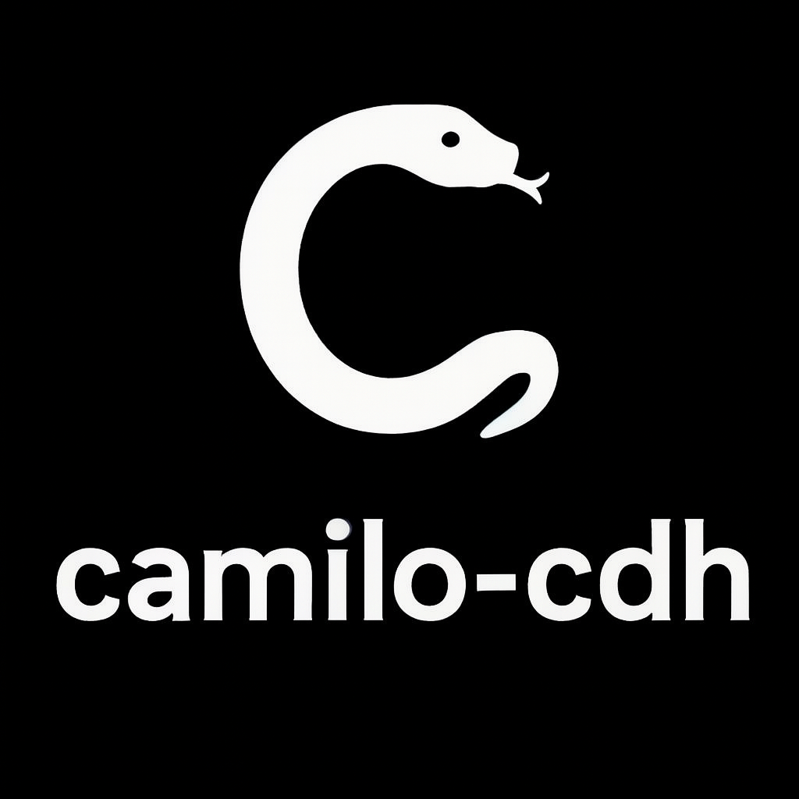

<a id="readme-top"></a>
<!-- PROJECT LOGO -->
<br />
<div align="center">
  <a href="https://github.com/camilo-cdh/catalogo-scrapers">
    
  </a>

  <h3 align="center">Catálogo Scrapers</h3>

  <p align="center">
    Catálogo de productos obtenidos mediante scrapers desarrollada en Streamlit
    <br />
    <a href="https://github.com/camilo-cdh/catalogo-scrapers"><strong>Explora el repositorio »</strong></a>
    <br />
  </p>
</div>


<!-- ABOUT THE PROJECT -->

## 🛒 Catálogo Scrapers

Aplicación desarrollada en **Streamlit** para visualizar un catálogo de productos obtenidos mediante scrapers.  
Permite filtrar por categoría, ver detalles de cada producto y descargar la base de datos completa en formato JSON.

---

## 🚀 Características

- Visualización de productos en formato **grid 5 por fila**
- Filtro por categoría
- Contador de productos visibles
- Descarga del archivo `productos.json`
- Imágenes, precios, descripciones y enlaces clickeables
- Interfaz limpia y lista para producción

---

## 📁 Estructura del proyecto

```sh
catalogo-scrapers/
│
├── app.py               # Aplicación Streamlit
├── productos.json       # Base de datos del catálogo
├── requirements.txt     # Dependencias
└── README.md            # Documentación del proyecto
```
---

## ▶️ Cómo ejecutar la app localmente

1. Clona el repositorio:
```sh
git clone https://github.com/camilo-cdh/catalogo-scrapers.git
cd catalogo-scrapers
```
2. Instala dependencias:
```sh
pip install -r requirements.txt
```
3. Ejecuta la app:
```sh
streamlit run app.py
```
---

## ☁️ Despliegue en Streamlit Cloud

1. Sube el repositorio a GitHub
2. Entra a https://streamlit.io/cloud
3. Selecciona Deploy app
4. Elige tu repo y selecciona `app.py`
5. Streamlit Cloud detectará automáticamente `requirements.txt`

---

## 🕷️ Origen de los datos: Scraper Playwright

Este catálogo no está construido manualmente: los productos provienen de un scraper desarrollado con Playwright, el cual extrae información desde distintas tiendas y genera el archivo **'productos.json'** utilizado por esta aplicación:

[**Scraper Playwright**](https://github.com/camilo-cdh/scraper-productos/)


---

## 📦 Base de datos

El archivo `productos.json` contiene la información del catálogo, con los siguientes campos:

- nombre
- categoria
- productor
- precio
- descripcion
- cc
- imagen_url
- producto_url
- fuente
- fuente_url

---

### Ejemplo de JSON
```sh
[
    {
        "nombre": "PACK VILLA CARDEA - LA DOLCE VITA BRUT",
        "categoria": "Vinos",
        "productor": "LA DOLCE VITA",
        "precio": 10990,
        "descripcion": "Vive la magia del verano con este pack perfecto para preparar un Spritz inolvidable. Incluye 1 Villa Cardea y 2 botellas de La Dolce Vita Brut.\nMezcla estos ingredientes con un toque de soda y una rodaja de naranja para crear un Spritz que transportará tus sentidos a un soleado día italiano.",
        "cc": "",
        "imagen_url": "https://lavinoteca.vtexassets.com/arquivos/ids/164884-800-1000?v=638730865347030000&width=800&height=1000&aspect=true",
        "producto_url": "https://www.lavinoteca.cl/pack-aperol-la-dolce-vita-brut/p",
        "fuente": "Vinoteca",
        "fuente_url": "https://www.lavinoteca.cl"
    },
    {
        "nombre": "JARDIN DE L'EDEN CUVEE 2 BRUT",
        "categoria": "Vinos",
        "productor": "JARDIN DE L'EDEN",
        "precio": 35990,
        "descripcion": "Espumante nacional producido con el Método tradicional, con uvas Pinot Noir y Chardonnay, con una segunda fermentación en botella. Un espumante para la gastronomía.",
        "cc": "750",
        "imagen_url": "https://lavinoteca.vtexassets.com/arquivos/ids/156799-800-1000?v=636947871072570000&width=800&height=1000&aspect=true",
        "producto_url": "https://www.lavinoteca.cl/jardin-l-eden-cuvee-2-brut/p",
        "fuente": "Vinoteca",
        "fuente_url": "https://www.lavinoteca.cl"
    }
]
```

---

## 🧑‍💻 Autor

* **Camilo Diaz** - *Backend Developer* - [Camilo-cdh](https://github.com/camilo-cdh/)

---

## 📜 Licencia

Este proyecto puede ser utilizado libremente para fines educativos y de desarrollo.


